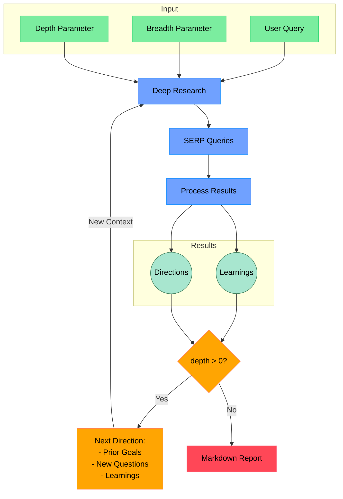

# CodeGuide Deep Research API

[](https://codeguide.dev)

> This is a fork of [Open Deep Research](https://github.com/dzhng/deep-research) by [@dzhng](https://x.com/dzhng), enhanced with REST API implementation and integrated into the CodeGuide platform.

An AI-powered research assistant that performs iterative, deep research on any topic by combining search engines, web scraping, and large language models. This enhanced version provides a REST API interface and is integrated into the [CodeGuide platform](https://app.codeguide.dev).

The core functionality remains true to the original project's goal of providing a simple implementation of a deep research agent - one that can refine its research direction overtime and deep dive into a topic.

## Access

This service is available to all CodeGuide members at [app.codeguide.dev](https://app.codeguide.dev).
You'll have access to the following features:
- User-friendly interface for conducting research
- Real-time results and generated reports
- Integrations with other CodeGuide features (coming soon)


## How It Works



## Features

- **REST API Implementation**: Full REST API support with comprehensive documentation
- **CodeGuide Integration**: Seamlessly integrated with the CodeGuide platform
- **API Documentation**: Interactive Swagger/OpenAPI documentation
- **Iterative Research**: Performs deep research by iteratively generating search queries, processing results, and diving deeper based on findings
- **Intelligent Query Generation**: Uses LLMs to generate targeted search queries based on research goals and previous findings
- **Depth & Breadth Control**: Configurable parameters to control how wide (breadth) and deep (depth) the research goes
- **Smart Follow-up**: Generates follow-up questions to better understand research needs
- **Comprehensive Reports**: Produces detailed markdown reports with findings and sources
- **Concurrent Processing**: Handles multiple searches and result processing in parallel for efficiency

## API Usage

The API is accessible at `https://api.codeguide.dev/research`. Detailed API documentation is available at `https://api.codeguide.dev/docs`.

### Authentication

All API requests require authentication using your CodeGuide API key. Include it in the request header:

```bash
x-api-key: API_KEY
```

### Example Request

```bash
curl -X POST https://api.codeguide.dev/research \
  -H "x-api-key: API_KEY" \
  -H "Content-Type: application/json" \

  -d '{
    "query": "Your research query",
    "breadth": 6,
    "depth": 3
  }'
```

## Local Development Setup

1. Clone the repository
2. Install dependencies:

```bash
npm install
```

3. Set up environment variables in a `.env.local` file:

```bash
FIRECRAWL_KEY="your_firecrawl_key"
# If you want to use your self-hosted Firecrawl, add the following below:
# FIRECRAWL_BASE_URL="http://localhost:3002"

OPENAI_KEY="your_openai_key"

# API Configuration
PORT=3000
API_KEY="your_development_api_key"
```

## Running Locally

Start the API server:

```bash
npm run dev
```

The API will be available at `http://localhost:3000` with documentation at `http://localhost:3000/docs`.

## License

MIT License - feel free to use and modify as needed.

## Acknowledgments

This project is a fork of [Open Deep Research](https://github.com/dzhng/deep-research) by [@dzhng](https://x.com/dzhng). We've extended it with REST API capabilities and integrated it into the CodeGuide platform while maintaining the core functionality of the original project.
